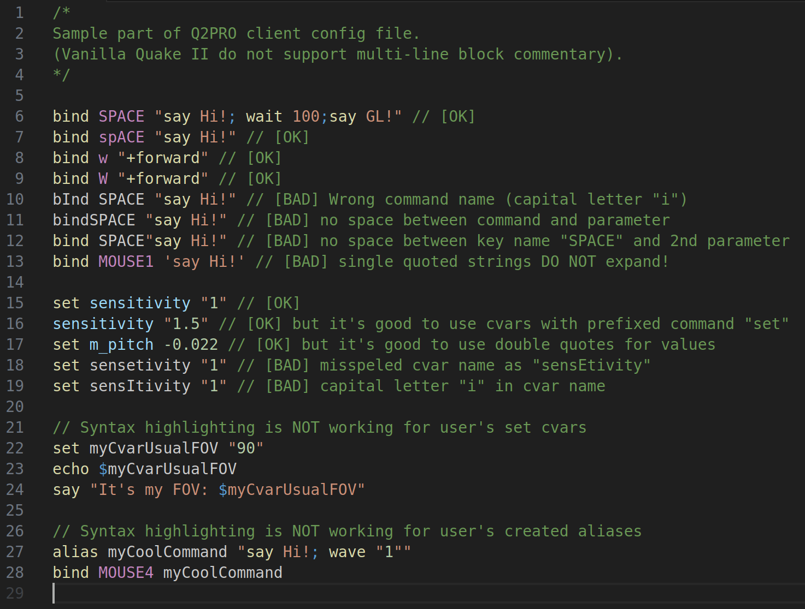
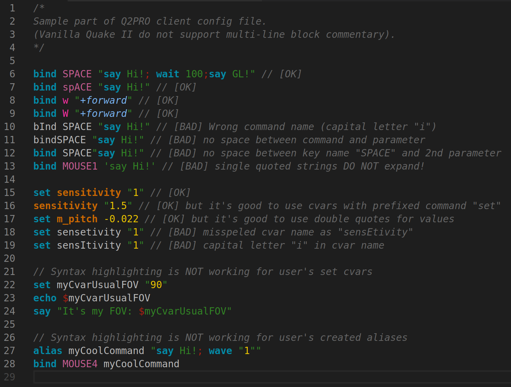
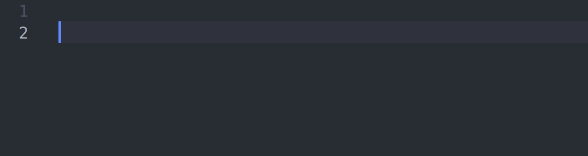

# Syntax highlighting for Quake 2 configuration files (Vanilla, Q2PRO, OpenFFA, OpenTDM, CTF, 3ZB2, Yamagi Quake II)

**Syntax highlighting** for [Quake II](https://en.wikipedia.org/wiki/Quake_II) **configuration files**. With support for modern source ports **Q2PRO** and **Yamagi Quake II**, game modifications **OpenFFA** & **OpenTDM** (widely used for multiplayer servers and modern successors of [OSP Tourney DM](https://www.orangesmoothie.org/tourney/)), **Yamagi CTF** and **Yamagi 3rd Zigock Bot II**.

> Note: This extension would work as a stand-alone, but for better colorizing the user should change the color theme to `Quake 2 Config Dark Color Theme`. Theme should be already installed as dependency, but could be found at store as [amokmen.quake2-config-theme-dark](https://marketplace.visualstudio.com/items?itemName=amokmen.quake2-config-theme-dark).

- [Syntax highlighting for Quake 2 configuration files (Vanilla, Q2PRO, OpenFFA, OpenTDM, CTF, 3ZB2, Yamagi Quake II)](#syntax-highlighting-for-quake-2-configuration-files-vanilla-q2pro-openffa-opentdm-ctf-3zb2-yamagi-quake-ii)
  - [Description](#description)
  - [Target audience](#target-audience)
  - [How to Use?](#how-to-use)
  - [Features](#features)
    - [Syntax Highlighting](#syntax-highlighting)
    - [Snippets](#snippets)
  - [Details](#details)
    - [How it works?](#how-it-works)
      - [First extension ("tokenizer")](#first-extension-tokenizer)
      - [Second extension ("colorizer")](#second-extension-colorizer)
    - [Regexp explanation](#regexp-explanation)
      - [Numbers](#numbers)
    - [How to make your own colors and/or font attributes](#how-to-make-your-own-colors-andor-font-attributes)
    - [Scopes naming explanation](#scopes-naming-explanation)
    - [Scopes precedence](#scopes-precedence)
    - [All scopes with description](#all-scopes-with-description)
      - [Cvars](#cvars)
      - [Commands](#commands)
  - [Links](#links)
    - [Modern Q2 source ports (game engines)](#modern-q2-source-ports-game-engines)
    - [Modern Q2 game modifications (also calling "mods")](#modern-q2-game-modifications-also-calling-mods)
    - [Useful docs](#useful-docs)
  - [Known Issues](#known-issues)
  - [Developing](#developing)
  - [Rules](#rules)

## Description

This extension provides only basic [Syntax Highlighting](https://code.visualstudio.com/api/language-extensions/syntax-highlight-guide/) (no Semantic highlighting).

Should work with any VS Code *theme* (see [Known Issues](#known-issues)).

Example for *VS Code default dark theme*:



Example for `Quake 2 Config Dark Color Theme`:


## Target audience

For people who need to reading & writing Quake 2 configuration files:

- for any Quake 2 gamer;
- for Q2-server administrators.

## How to Use?

1. Install **Visual Studio Code** (an open-source, cross-platform editor) or use it [online](https://vscode.dev). There is **also an option** to create a portable VS Code.
2. Install the extension.
    - Go to the **Menu: View > Extensions**, input "quake2" into the search field, choose "Quake II Syntax Highlighting" and install it.
    - Optional: there is a second dependency extension `amokmen.quake2-config-theme-dark` which will be automatically installed. Use it for better colorization (it's a specially created color theme). Change the VS Code theme to "Quake II Config Dark Theme" by going to **Menu: File > Preferences > Color Theme**.
3. Open a Quake 2 configuration file in the Editor by going to **Menu: File > Open File**. The file can have a *.cfg* extension, no extension, or any other extension.
4. To make VS Code understand that the current file is a "Quake 2 configuration":
    - Press **Select Language Mode** at the bottom of the Editor's interface and choose the "q2config" language;
    - Or go to **Menu: View > Command Palette**, input "Change language mode" and choose the "q2config" language.

## Features

### Syntax Highlighting

Syntax highlighting works for:

- **Console commands** (e.g., "bind", "set", "alias");
- **Console variables** (cvars) (e.g., "sensitivity", "rcon_password");
- **Keyboard key names** (e.g., special names like "SPACE", "KP_HOME", "SEMICOLON", "MWHEELUP", "F1" or usual keys like "q", "1", ".");
- **Strings** (single and double quoted);
- **Numbers** (in different formats);
- **Comments** (in-line, single-line, block).

Syntax highlighting doesn't work for:

- **Cvars** created by the user;
- **Aliases** (new commands) created by the user.

### Snippets

There are a few useful *snippets* (for execution just input short prefix of snippet and choose snippet in list):

- "dj" - Double Jump (to perform jump tricks);
- "zoom" - Zooming and changing sensitivity while button is pressed;
- "fish" - Fish-eye (wider observation);
- "line" - Choosing 'best' available weapon from pre-set order;
- "" - drops for TDM;
- "" - drops for CTF;
- "" - semi-automated Rocket Jump (user should view at ground by himself).

New in Q2PRO - *triggers*, so snippets to use with:

- "" - automated start of demo recording in TDM, after match begins.



## Details

Quake 2 is a sequel to the iconic FPS game by id Software.

It features a basic scripting language (console commands of different types and console variables) that can be used by players and server admins for writing configuration files.

The Q2PRO source port improves this scripting language by adding triggers, an "IF" command, and more.

### How it works?

#### First extension ("tokenizer")

- The extension has *lists* of *words that need to be colorized*, and each list has its own *scope name* (see [Scopes naming explanation](#scopes-naming-explanation)).
- All these lists are called *"grammar"* (based on [TextMate](https://macromates.com/manual/en/language_grammars/) rules) and you can find them in the file `syntaxes/q2config.tmLanguage.json`.
- The grammar is attached to a "language", in our case with the name "q2config".
- After opening a text file that is marked as "q2config", VS Code will try to find words from the lists line-by-line using regular expressions (regexps) - this process is called "tokenization".
- For every word found, VS Code assigns its scope name.
- Done!

#### Second extension ("colorizer")

- After the tokenization process, VS Code has some words with assigned scope names.
- Matches between *scope names* and colors are in `themes/quake2-config-theme-dark.json`.
- So, it's time to colorize words!
- ...
- PROFIT!!!

### Regexp explanation

You could check any regexp from `syntaxes/q2config.tmLanguage.json` online, for example, [here](https://regex101.com). But be careful - need to change doubled symbols "\\\\" to single one "\\" (Ex.: "\\\b" --> "\\b"). Because in JSON there must be double escaping.

TODO: add explanations and examples

#### Numbers

Numbers are arguments for cvars and some commands.

What numbers should be catched:

- `0`, `1`, `2`, `123`
- `-1`
- `0.1`, `-0.1`
- `.1`
- `0.001`

Should not be catched:

- `-.1`

Examples: `set sensitivity 2`, `sensitivity "2"`, `alias myCommand "set sensitivity 2; say Hi!"`.

Regexp (JSON variant with double `\\`): `(?<=(\\s|\"))-?([0-9]*[.])?[0-9]+(?=(\\s|\"))`

Same regexp: `(?<=(\s|\"))-?([0-9]*[.])?[0-9]+(?=(\s|\"))`

This regexp explanation:

Prefix `(?<=(\s|\"))` - what should be BEFORE catching number (and not be included into result!) - `\s` - means any white symbol(s) OR `\"` - means double qoute.

Main part `-?([0-9]*[.])?[0-9]+` - `-?` could be or not be minus sign; ???

Postfix `(?=(\s|\"))` - what should be AFTER catching number (and not be included into result!)

### How to make your own colors and/or font attributes

Let's make all OpenTDM cvars green and bold for example, and all OpenFFA cvars blue and italic bold.

Add to `.vscode/settings.json` (create directory ".vscode" at root of your project's directory and create empty file "settings.json" in it) next section:

```json
{
  "editor.tokenColorCustomizations": {
    "textMateRules": [
      {
        "scope": ["variable.q2config.cvars.game.opentdm"],
        "settings": {
          "foreground": "#008000",
          "fontStyle": "bold"
        }
      },
      {
        "scope": ["variable.q2config.cvars.game.openffa"],
        "settings": {
          "foreground": "#0000cd",
          "fontStyle": "italic bold"
        }
      }
    ]
  }
}
```

These settings would *override* your *current theme* settings.

You could change only 2 things: color of text and font attributes (italic, bold, underline, strikethrough and any combination of these 4 attributes).

Use *scope name* that you want to modify, from the file `syntaxes/q2config.tmLanguage.json`.

### Scopes naming explanation

Ex.1: let's explode scope name `variable.q2config.cvars.game.opentdm` from left to right order.

`variable`.`q2config.cvars.game.opentdm` - left part "variable" is special TextMate name, right part is created by me.

- "variable" - *base scope name* (one of TextMate's base scopes) - all theme authors *should* orient to this and any theme default styling depends only at it;
- "q2config" - language name (created by me);
- "cvars" - type of text tokens (created by me);
- "game" - sub-category: "game" or "engine" (created by me);
- "opentdm" - name of game modification (created by me).

Ex.2: let's explode scope name `support.function.q2config.functions.q2pro` from left to right order.

`support.function`.`q2config.functions.q2pro` - left part "support.function" is special TextMate name, right part is created by me.

- "support.function" - *base scope name*;
- "q2config" - language name (created by me);
- "functions" - type of commands (according to JakFrost's classification there are 3 types of commands: action, operation, function) (created by me);
- "q2pro" - name of engine/mod (created by me).

### Scopes precedence

later scopes override earlier scopes ?????

### All scopes with description

> Note: Order is important for priority while tokenization process! Order in which objects are placed in array "patterns". First object has higher priority.

TODO: add explanation for every scope

TODO: create good visualization for scopes

#### Cvars

`variable`.`q2config`.`cvars`.`engine`.`q2pro`
`variable`.`q2config`.`cvars`.`engine`.`vanilla`
`variable`.`q2config`.`cvars`.`game`.`q2pro`/`openffa`/`opentdm`/`yamagi-ctf`/`yamagi-3zb2`

Meaning of "game" here - "game modification".

`variable.q2config.cvars.game`:

- `.q2pro`
- `.openffa`
- `.opentdm`
- `.yamagi-ctf`
- `.yamagi-3zb2`

#### Commands

`support.function`.`q2config`.`commands`.`actions`.`vanilla`
`support.function`.`q2config`.`commands`.`functions`.`q2pro`

## Links

### Modern Q2 source ports (game engines)

- [Q2PRO](https://github.com/skullernet/q2pro/) - is a modern *multiplayer-oriented* client/server for Windows/Linux.
- [Yamagi Quake II](https://github.com/yquake2/yquake2/) - is a modern *single-player and coop oriented* client/server for Windows/Linux/macOS.

### Modern Q2 game modifications (also calling "mods")

- [OpenFFA](https://github.com/skullernet/openffa/) - Free-for-all (FFA) death match (DM).
- [OpenTDM](https://github.com/skullernet/opentdm/) - Team play death match (TDM) and Duels.
- [Yamagi Capture The Flag (CTF)](https://github.com/yquake2/ctf/) - modified original Q2 CTF (64 bit library).
- [Yamagi 3rd Zigock Bot II (3ZB2)](https://github.com/yquake2/3zb2/) - famous Q2-bot for DM&CTF.

### Useful docs

- [Quake 2 Console Commands by JakFrost (version at December 3, 1998)](https://www.eecis.udel.edu/~portnoi/quake/quakeiicom.html) and there [last version of original article](https://web.archive.org/web/20040603155751/http://www.planetquake.com/console/commands/quake_2.html) saved by Web Archive.

## Known Issues

- Cvars would be white in *Nord* theme as any other text - hard to read.

## Developing

Linux-based: paths, EOL and so on.

For testing under VS Code:

- run new VS Code debug window by pressing `F5`
- there would be opened test files for MANUAL VISUAL control

## Rules

- Command `set` is optional, both cases are valid: `set sensitivity "1"` and `sensitivity "1"`.
- Do not use single quotes - engine would take such string "as is" (without expanding) even including quotes themselves (Ex.: `say 'Hi'` would produce exact `'Hi'`, but `say "Hi"` --> `Hi`).
- Quake 2 vanilla do not support block comments, but Q2PRO does support "/\* Multiline block comment \*/".
- Q2PRO supports new syntax for `wait` command: `wait N`, where N - number of waits (like wait*N).
- Assign value to cvar:
  - Many white-spaces before value would be removed `set sensitivity     1` --> `sensitivity is "1"`.
  - But nothing would be removed if value was double quoted! `set sensitivity " 1"` --> `sensitivity is " 1"`.
